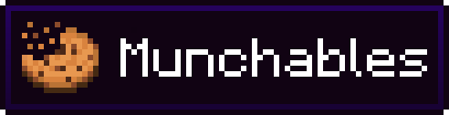

<div style="text-align: center;">

<br>

<h2>
<b>A simple, light-weight, and data-driven API for adjusting eat times in Minecraft!</b>
</h2>
<br>
<a href="">

</a>
<a href="https://github.com/ramGemes/Munchables">

</a>
<a href="">

</a>
<br>


</div>

## FAQ

---
### Is this compatible with X mod?
Yes! This mod is fully compatible with all other food mods! Note however that if the mod contains a custom eat time itself, this mod is not able to change it.


## How To Use

---

1. create a data pack
2. create the folder `namespace/munchables`
3. In the new folder, create a json file named `item_id.json`
4. Have the json file follow the following schema:
```
{
    "replace": boolean // if set to true, will override the entry item if it already exists
    "eatTime": int // the time in ticks it takes to eat the item
}
```
This example would change the eat time for the item: `namespace:item_id`